# DVWA Security Lab Report
**Course:** CS382 – Cybersecurity  
**Tool:** Damn Vulnerable Web Application (DVWA) via Docker  

---

## Environment Setup

- **Docker Image:** `vulnerables/web-dvwa`
- **Container Port:** `8080:80`
- **Access URL:** `http://localhost:8080`
- **Login:** `admin` / `password`

```bash
docker pull vulnerables/web-dvwa
docker run -d --name dvwa -p 8080:80 vulnerables/web-dvwa
```

---

## Vulnerabilities Tested

1. [Brute Force](#1-brute-force)
2. [Command Injection](#2-command-injection)
3. [CSRF](#3-csrf)
4. [File Inclusion](#4-file-inclusion)
5. [File Upload](#5-file-upload)
6. [Insecure CAPTCHA](#6-insecure-captcha)
7. [SQL Injection](#7-sql-injection)
8. [SQL Injection (Blind)](#8-sql-injection-blind)
9. [Weak Session IDs](#9-weak-session-ids)
10. [XSS – DOM](#10-xss--dom)
11. [XSS – Reflected](#11-xss--reflected)
12. [XSS – Stored](#12-xss--stored)
13. [JavaScript](#13-javascript)
14. [CSP Bypass](#14-csp-bypass)

---

## 1. Brute Force

### 🔴 Low Security
**Tool/Method:** Manual entry (simulating a dictionary attack).  
**Result:** Successfully logged in using `admin` / `password`.  
**Screenshot:** 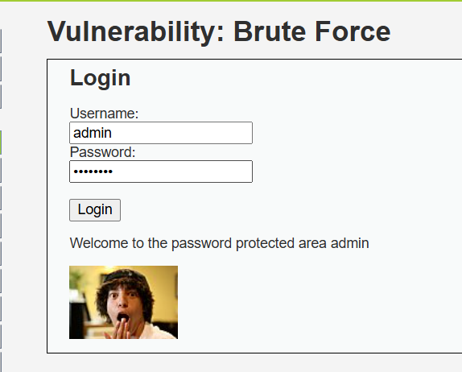  
**Why it worked:** There are no server-side protections. The application processes the request immediately, allowing an attacker to automate thousands of login attempts per second without any lockout or delay.

---

### 🟡 Medium Security
**Tool/Method:** Manual entry.  
**Result:** Successful login, but failed attempts resulted in a noticeable delay.  
**Screenshot:** 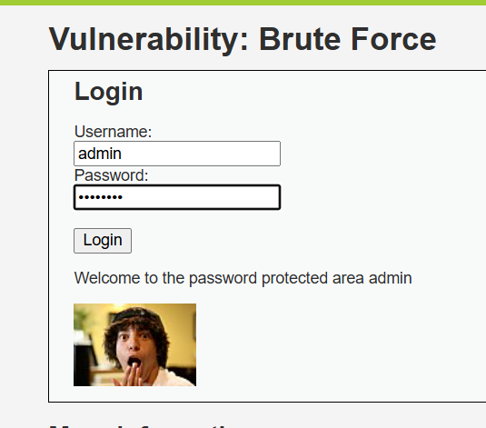  
**Why it was harder:** The server-side script includes a `sleep(2)` function call whenever a login attempt fails. This adds a 2-second delay to every incorrect guess.  
**Why it still worked:** While the delay slows down a brute force attack significantly, it does not actually stop it. An attacker with enough time can still eventually guess the password.

---

### 🟢 High Security
**Tool/Method:** Manual entry.  
**Result:** Successful login, but requires a unique CSRF token per attempt.  
**Screenshot:** 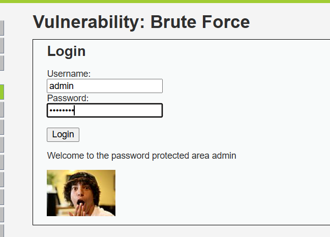  
**Why it failed / mitigation used:** The High security level implements a CSRF token (anti-automation token) and a random `sleep()` delay. The token must be scraped from the login page and submitted with the credentials, which breaks simple automated brute-force scripts. Additionally, the random delay makes it harder for attackers to predict response times.

---

## 2. Command Injection

### 🔴 Low Security
**Payload:** `127.0.0.1; whoami; pwd; ls`  
**Result:** Displays the ping results followed by the username `www-data`, the current directory `/var/www/html/vulnerabilities/exec`, and the list of files in that directory.  
**Screenshot:** 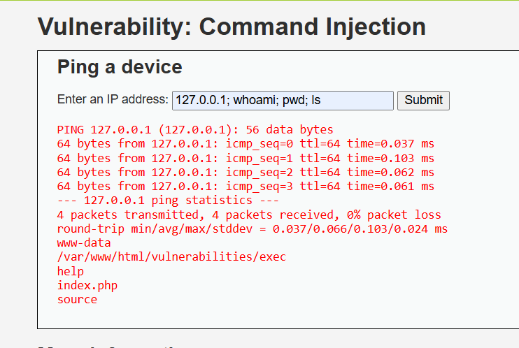  
**Why it worked:** The application directly pipes the user input into the `shell_exec()` function. By using the `;` separator, we can terminate the ping command and execute our own commands (`whoami`, `pwd`, `ls`).

---

### 🟡 Medium Security
**Payload:** `127.0.0.1 & ls`  
**Result:** Displays the ping results, followed sequentially by the output of the `ls` command (which shows `help`, `index.php`, and `source`).  
**Screenshot:** 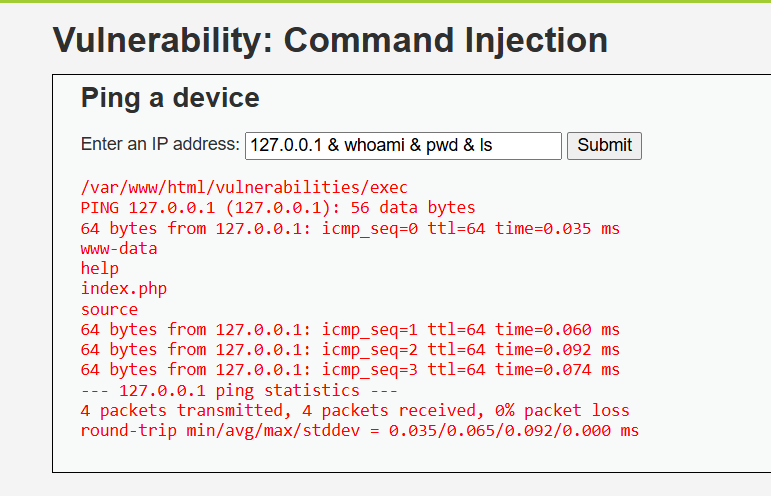  
**Why it was harder:** The developer implemented a blacklist that removes `&&` and `;`. If you use the Low payload, the `;` is removed, and the command becomes broken.  
**Why it still worked:** The blacklist was incomplete. It didn't filter the single `&` character, which allows us to run commands asynchronously.

---

### 🟢 High Security
**Payload:** `127.0.0.1 |ls` (Critical: **No space** after the pipe)  
**Result:** Displays only the output of `ls` (`help`, `index.php`, `source`). The ping output is piped away.  
**Screenshot:** 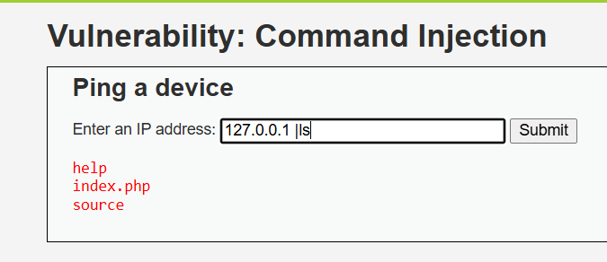  
**Why it failed / mitigation used:** The developer expanded the blacklist to include `&`, `;`, `|`, `-`, `$`, etc. However, there is a typo in the blacklist: they filtered `'| '` (pipe followed by a space) instead of just `'|'`.  
**Why it still worked:** By removing the space between the pipe and our command, we bypass the filter and execute the command. This demonstrates that blacklisting is extremely difficult to get right.

---

## 3. CSRF

### 🔴 Low Security
**Payload:** `http://localhost:8080/vulnerabilities/csrf/?password_new=hacked&password_conf=hacked&Change=Change`  
**Result:** The admin password is changed to `hacked` without the user submitting the form — just by visiting the crafted URL.  
**Screenshot:** 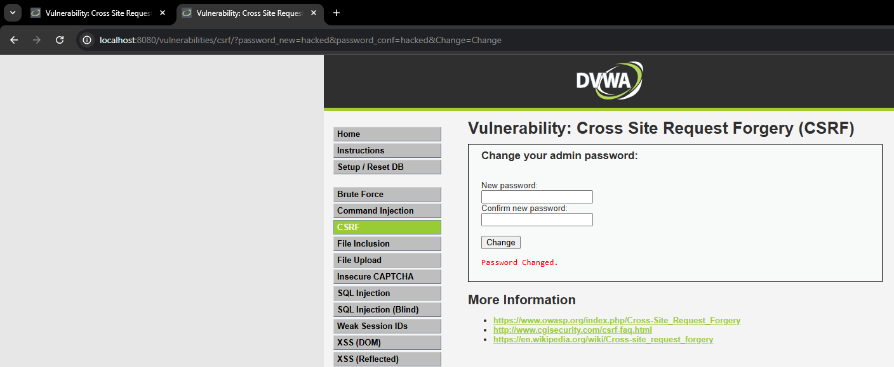  
**Why it worked:** The application processes GET parameters directly using the session cookie, with no check that the request came from the actual form. An attacker can forge a request by crafting a URL.

---

### 🟡 Medium Security
**Method:** Bypassing `Referer` check using Chrome DevTools `fetch` modification.
**Result:** Password change is successful after modifying the Referer header to include "localhost".
**Screenshot:** 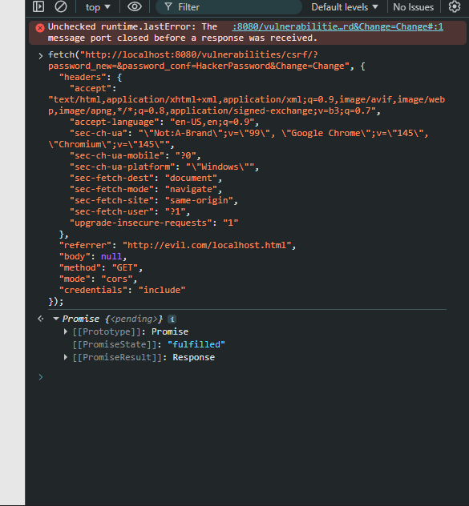  
**Why it was harder:** The server now checks the HTTP `Referer` header to ensure the request originated from the same site.  
**Why it still worked:** The `Referer` check only verifies that the string `localhost` appears anywhere in the Referer URL. By using "Copy as fetch" in the Network tab, pasting it into the Console, and changing the `"referrer"` value to a fake URL containing "localhost" (e.g., `http://evil.com/localhost.html`), the server accepts the forged request.

---

### 🟢 High Security
**Method:** Required predictable CSRF token. Attempted direct URL injection.
**Result:** Attack is blocked — each request requires a unique, unpredictable CSRF token tied to the user's session.
**Screenshot:** 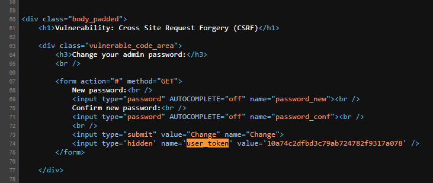  
**Why it failed / mitigation used:** High security generates a unique `user_token` for every page load that is tied to the session. Without scraping the page first to obtain this embedded hidden token, any forged request will be rejected by the server as invalid.

---

## 4. File Inclusion

### 🔴 Low Security
**Payload:** `?page=/etc/passwd`
**Result:** Successfully read the server's `/etc/passwd` file, listing all system users.
**Screenshot:** 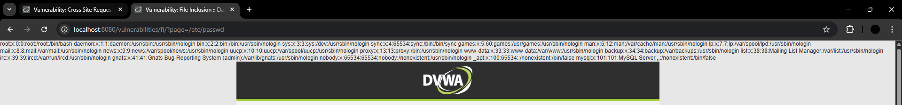  
**Why it worked:** The PHP `include()` function is used without any validation. It blindly accepts whatever string is passed in the `page` parameter and attempts to open it as a file.

---

### 🟡 Medium Security
**Payload:** `?page=..././..././..././..././..././..././etc/passwd`
**Result:** Successfully bypassed the `../` filter after 6 directory jumps to read `/etc/passwd`.
**Screenshot:** 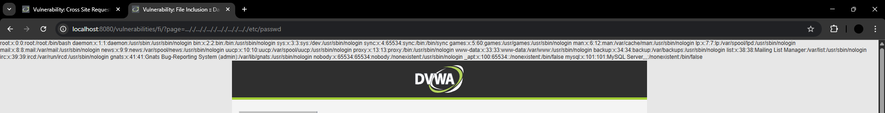  
**Why it was harder:** The developer implemented a filter to remove `../` and `..\` sequences to prevent directory traversal.
**Why it still worked:** The replacement only happens once per match. By inputting `..././`, the filter removes the inner `../`, leaving behind a valid `../` sequence. By doing this 6 times, we successfully traverse back to the root directory from the deep application folder.

---

### 🟢 High Security
**Payload:** `?page=file:///etc/passwd`
**Result:** Successfully bypassed the "file" prefix requirement using the `file://` protocol.
**Screenshot:** 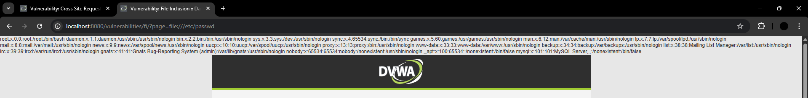  
**Why it failed / mitigation used:** The server implements a strict check where the input MUST start with the word "file". This is intended to whitelist only specific files.
**Why it still worked:** Using the `file:///` URI scheme satisfies the "starts with file" condition while still allowing us to point to any location on the local filesystem.

---

## 5. File Upload

### 🔴 Low Security
**Method:** Uploaded a simple PHP web shell (`shell.php`).
**Result:** File was uploaded successfully, and server-side execution was achieved by visiting the uploaded file path.
**Screenshot:** 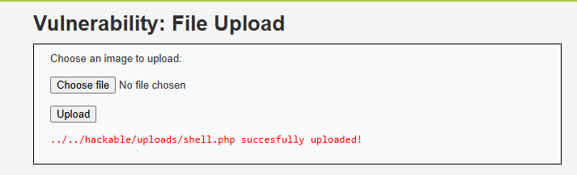  
**Why it worked:** There are no server-side checks on the file type or extension. The application simply moves the uploaded file to a public directory, allowing any file (including malicious script) to be executed.

---

### 🟡 Medium Security
**Method:** MIME-type bypass by changing `Content-Type` to `image/jpeg` using a browser `fetch` command.
**Result:** Successfully uploaded the PHP shell by tricking the server into thinking it was an image.
**Screenshot:** 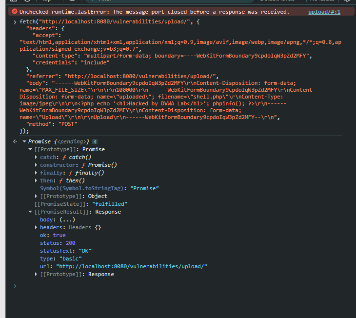  
**Why it was harder:** The application checks the `Content-Type` header sent by the browser to ensure it matches an allowed image type (e.g., `image/jpeg` or `image/png`).
**Why it still worked:** Browser headers are under the user's control. By using "Copy as fetch" in the Network tab and changing the payload's `Content-Type` to `image/jpeg` in the Console, the server-side validation was bypassed.

---

### 🟢 High Security
**Method:** PNG Magic Bytes bypass + File Inclusion chaining.
**Result:** Successfully uploaded a PHP shell hidden inside a valid PNG image and executed it via LFI.
**Screenshot:** 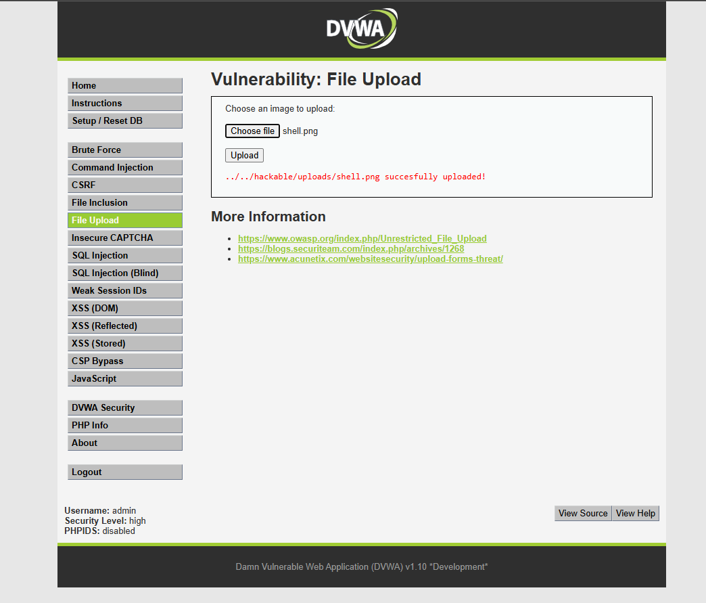  
**Why it failed / mitigation used:** The server uses `getimagesize()` to verify the file is a real image and only allows `.jpg`, `.jpeg`, or `.png` extensions.
**Why it still worked:** I used PowerShell to create a file containing valid PNG magic bytes followed by PHP code:
```powershell
$bytes = [System.Convert]::FromBase64String("iVBORw0KGgoAAAANSUhEUgAAAAEAAAABCAYAAAAfFcSJAAAADUlEQVR42mNkYAAAAAYAAjCB0C8AAAAASUVORK5CYII="); [System.IO.File]::WriteAllBytes("shell.png", $bytes); Add-Content "shell.png" '<?php phpinfo(); ?>'
```
The server accepted `shell.png` as a valid image. I then executed the code by chaining it with the File Inclusion vulnerability: 
`?page=../../../../hackable/uploads/shell.png`

---

## 6. Insecure CAPTCHA

### 🔴 Low Security
**Method:** Bypassing Step 1 by sending the Step 2 POST request directly.
**Result:** Successfully changed the password without ever solving the CAPTCHA.
**Screenshot:** 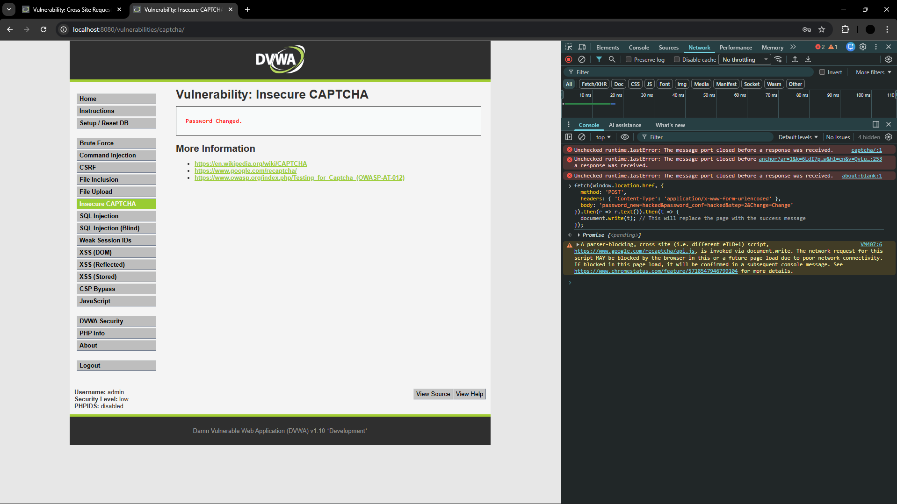  
**Why it worked:** The application uses a multi-step process. Step 1 shows the CAPTCHA, and Step 2 changes the password. The server-side script for Step 2 (`low.php`) blindly trusts the `step=2` parameter in the POST request without verifying if the user actually completed Step 1.

---

### 🟡 Medium Security
**Method:** Forging the `passed_captcha` parameter in the POST request.
**Result:** Bypassed the CAPTCHA verification by adding `passed_captcha=true` to the request body.
**Screenshot:**   
**Why it was harder:** The application now checks for a specific parameter (`passed_captcha`) to decide whether to permit the password change.
**Why it still worked:** This check is flawed because the parameter is sent by the client. By using Intercept (Burp Suite) or DevTools to add `&passed_captcha=true` to the Step 2 request, the server is tricked into thinking the CAPTCHA was solved.

---

### 🟢 High Security
**Method:** Combined Parameter and User-Agent spoofing.
**Result:** Successfully changed the password by emulating the internal reCAPTCHA verification response.
**Screenshot:** 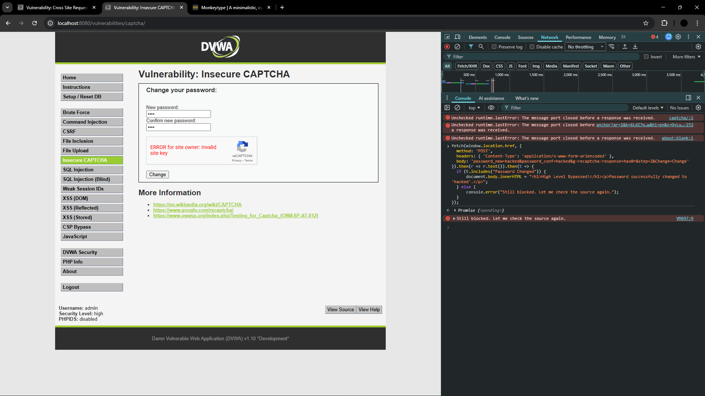  
**Why it failed / mitigation used:** The High security level attempts to verify the CAPTCHA response but includes a hardcoded "backdoor" for testing or legacy reasons.
**Why it still worked:** By setting the `g-recaptcha-response` parameter to `hidd3n_valu3` and the `User-Agent` header to `reCAPTCHA`, the server-side logic skips the real Google verification and permits the password change. This requires intercepting the request with a tool like Burp Suite since browsers restrict changing the User-Agent via script.

---

## 7. SQL Injection

### 🔴 Low Security
**Payload:**
```sql
1' OR '1'='1
```
**Result:** Successfully dumped the entire database of users (Usernames and Passwords).  
**Screenshot:** 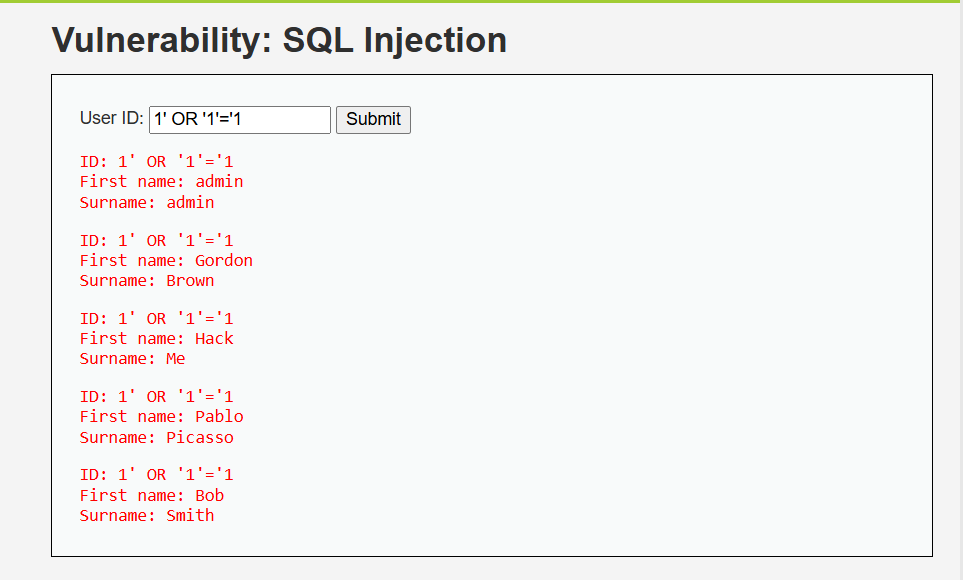  
**Why it worked:** The application directly concatenates user input into the SQL query without any sanitization or use of prepared statements. The `'` character closes the original string, and `OR '1'='1` makes the WHERE clause always true.

---

### 🟡 Medium Security
**Payload:** `1 OR 1=1` (sent via edited HTML value)  
**Result:** Successfully dumped the database after bypassing the dropdown menu.  
**Screenshot:** 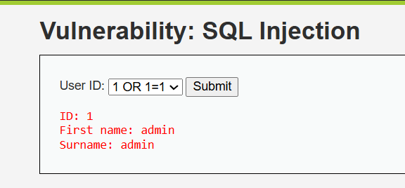  
**Why it was harder:** Direct text input was blocked by a dropdown menu, and the PHP code used `mysql_real_escape_string()` to escape single quotes.  
**Why it still worked:** I used "Inspect Element" to modify the value of the dropdown option to a SQL payload. Since the developer forgot to put quotes around the `$id` variable in the SQL query (e.g., `WHERE user_id = $id`), the `mysql_real_escape_string()` function was useless against numeric-based injection.

---

### 🟢 High Security
**Payload:** `1' OR '1'='1` (entered in the popup window)  
**Result:** Successfully dumped the database from a separate input window.  
**Screenshot:** 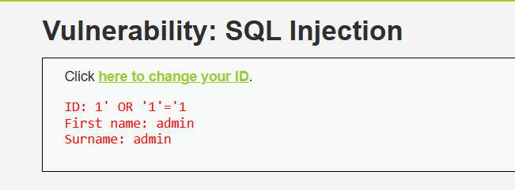  
**Why it failed / mitigation used:** The "High" level simply moved the input form to a separate popup page. This stops some automated scrapers but doesn't fix the underlying SQL injection vulnerability. The backend code remains vulnerable as it still doesn't use prepared statements.

---

## 8. SQL Injection (Blind)

### 🔴 Low Security
**Payload:** `1' AND 1=1 #` (True) vs `1' AND 1=2 #` (False)
**Result:** Successfully confirmed the existence of User ID 1 by observing the change in response message.
**Screenshot:**   
**Why it worked:** The input is not sanitized or parameterized. By injecting a boolean condition (`AND 1=1`), we can determine if the original query returned a row. If the page says "User ID exists", the condition was true. If it says "User ID is MISSING", the condition was false.

---

### 🟡 Medium Security
**Payload:** `1 AND 1=1` (True) vs `1 AND 1=2` (False)
**Result:** Bypassed `mysqli_real_escape_string` by using numeric-based injection.
**Screenshot:**   
**Why it was harder:** The application uses `mysqli_real_escape_string()` to escape quotes and uses a dropdown menu for input.  
**Why it still worked:** Since the SQL query does not wrap the ID in quotes (`WHERE user_id = $id`), escaping quotes has no effect. By intercepting the POST request and changing the ID to a boolean expression, we can infer database data.

---

### 🟢 High Security
**Payload:** `1' AND 1=1 #` (True) vs `1' AND 1=2 #` (False)
**Result:** Successfully exploited the vulnerability by modifying the `id` cookie.
**Screenshot:**   
**Why it failed / mitigation used:** The application uses a separate page to set a cookie and includes a `sleep()` function to slow down brute-force/automated attacks.  
**Why it still worked:** The security flaw is the same as the Low level (string concatenation in the query), just with a different input vector (cookies). By manually setting the cookie value to our payload, we bypass the intended input method.

---

## 9. Weak Session IDs

### 🔴 Low Security
**Method:** Observing incremental session ID values.
**Result:** Successfully predicted the next session ID by observing the consecutive incrementing integers in the `dvwaSession` cookie.
**Screenshot:** 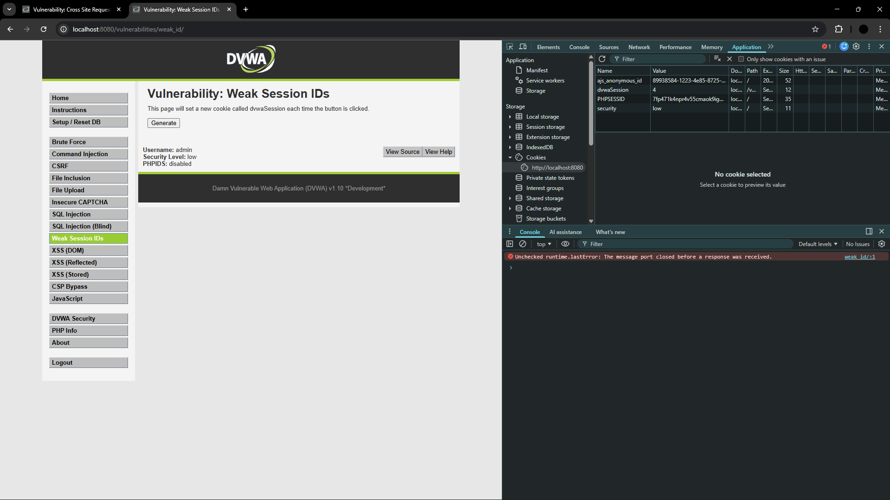  
**Why it worked:** The server generates the session ID by simply incrementing an integer counter stored in the session (`last_session_id++`). An attacker can easily guess the session ID of the next user to log in.

---

### 🟡 Medium Security
**Method:** Identifying time-based session IDs.
**Result:** Predicted session IDs by converting the cookie value to a Unix timestamp.
**Screenshot:**   
**Why it was harder:** The session ID is no longer a simple counter, making it appear randomized at first glance.  
**Why it still worked:** The server uses the PHP `time()` function to generate the ID. Since timestamps are sequential and globally synchronized, an attacker can pinpoint a user's session ID if they know the approximate time of login.

---

### 🟢 High Security
**Method:** Reversing MD5-hashed incremental IDs.
**Result:** Successfully predicted the next hashed session ID by hashing the next expected integer in the sequence.
**Screenshot:** 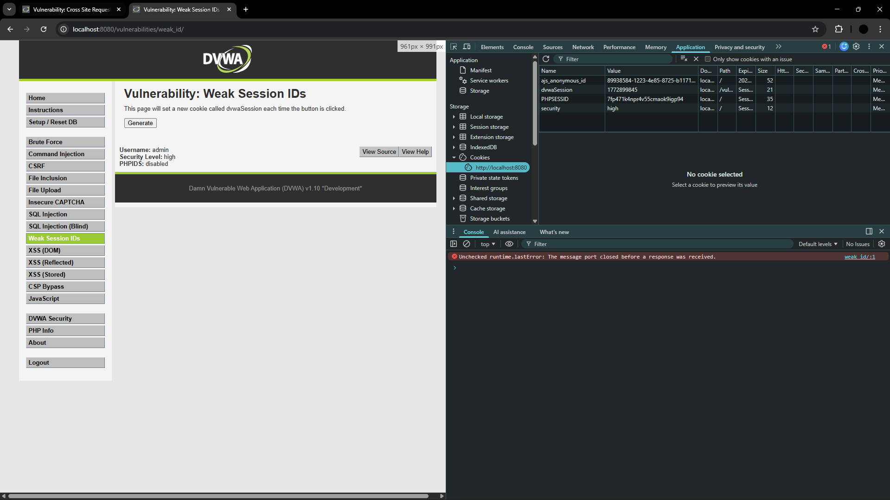  
**Why it failed / mitigation used:** The session ID is an MD5 hash, which hides the underlying sequence from casual observation.  
**Why it still worked:** The underlying value is still just an incremental counter (`md5(count++)`). Hashing a predictable value does not make it secure; it only adds a thin layer of obfuscation that can be trivially bypassed.

---

## 10. XSS – DOM

### 🔴 Low Security
**Payload:** `?default=<script>alert('XSS')</script>`
**Result:** Successfully executed the script, triggering an alert box.
**Screenshot:** 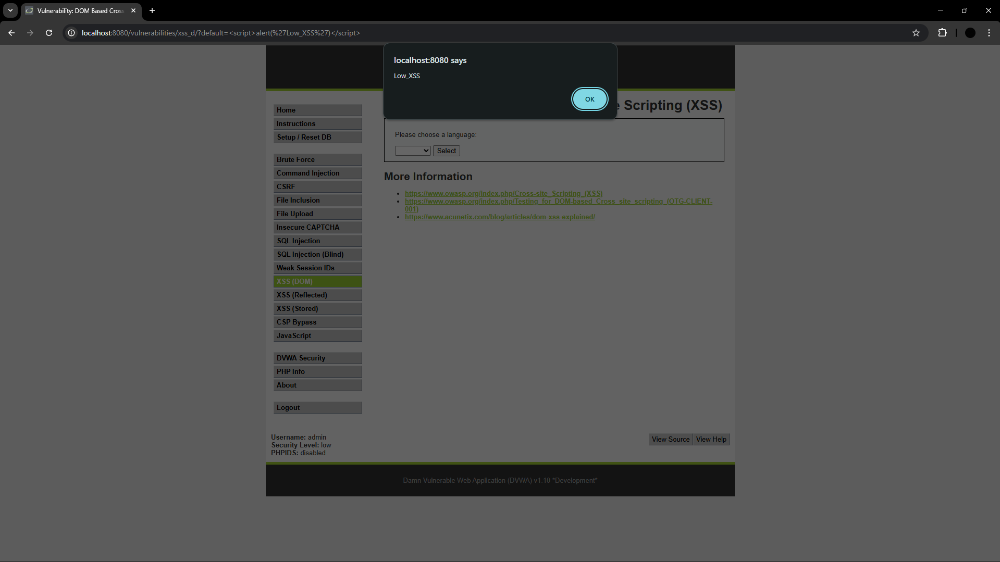  
**Why it worked:** The application reads the `default` parameter directly from the URL and uses it to update the DOM via `document.write`. There is no sanitization or encoding.

---

### 🟡 Medium Security
**Payload:** `?default=English</option></select>`
**Result:** Bypassed the server-side `<script` block by using an `img` tag event handler.
**Screenshot:** 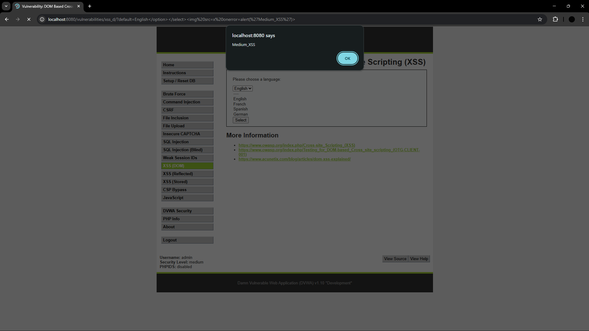  
**Why it was harder:** The server-side PHP code uses `stripos()` to check if the input contains `<script`. If it does, the request is redirected to the default page.
**Why it still worked:** The protection only looks for a specific tag. By using different tags or event handlers like `onerror` or `onload`, the filter is bypassed while still achieving script execution in the DOM.

---

### 🟢 High Security
**Payload:** `?default=English#</option></select>`
**Result:** **Success (Successfully bypassed after reload).**
**Screenshot:** 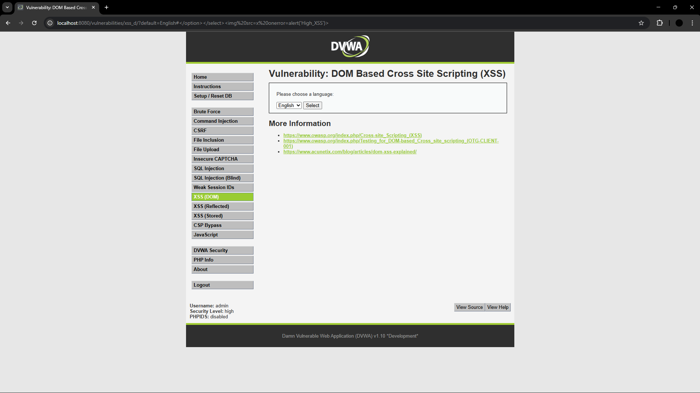  
**Why it failed / mitigation used:** The server uses a strict whitelist (`switch` statement) that only allows certain language names. Any value other than the allowed ones in the `default` parameter results in a redirect.
**Why it still worked:** 
1. **Fragment Identifier (#) Bypass:** By putting the payload after the `#`, it is not sent to the server. The PHP whitelist only sees `default=English` and accepts it.
2. **Tag Breakout:** The client-side JavaScript reads the whole URL and injects the fragment into the DOM. By using `</option></select>`, we "break out" of the HTML tags that would otherwise prevent script execution.
3. **Trigger:** The browser executes the injected tag (like an `img` with `onerror`) when the page is rendered or reloaded, triggering the alert box.

---

## 11. XSS – Reflected

### 🔴 Low Security
**Payload:** `<script>alert('XSS')</script>`
**Result:** Successfully executed the script via the URL parameter.
**Screenshot:** 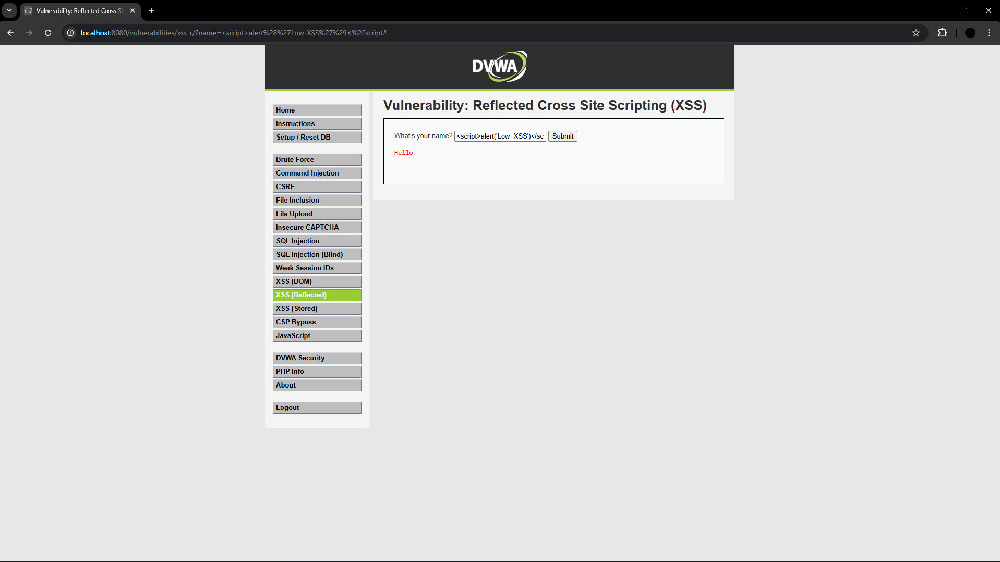  
**Why it worked:** The server-side script takes the `name` parameter from the GET request and echoes it directly into the HTML response inside `<pre>` tags without any sanitization or encoding.

---

### 🟡 Medium Security
**Payload:** `<sc<script>ript>alert('XSS')</script>`
**Result:** Bypassed the case-sensitive and non-recursive `str_replace` filter.
**Screenshot:** 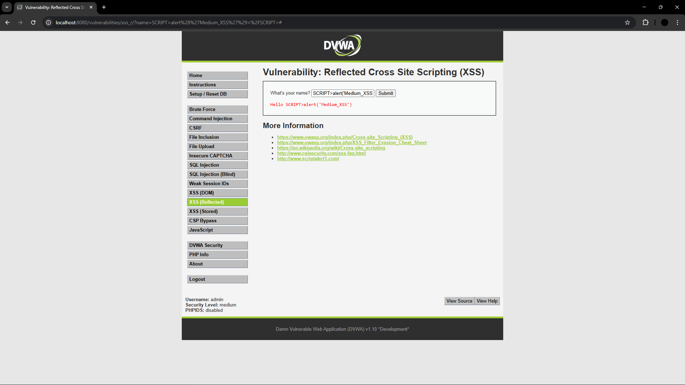  
**Why it was harder:** The application uses `str_replace( '<script>', '', ... )` to remove potential script tags.
**Why it still worked:** The filter only looks for the literal string `<script>` in lowercase and is not recursive. By nesting the tag or using mixed case (e.g., `<SCRIPT>`), the filter fails to remove the entire malicious payload.

---

### 🟢 High Security
**Payload:** ``
**Result:** Bypassed the regex-based script tag filter by using an alternative HTML tag.
**Screenshot:** 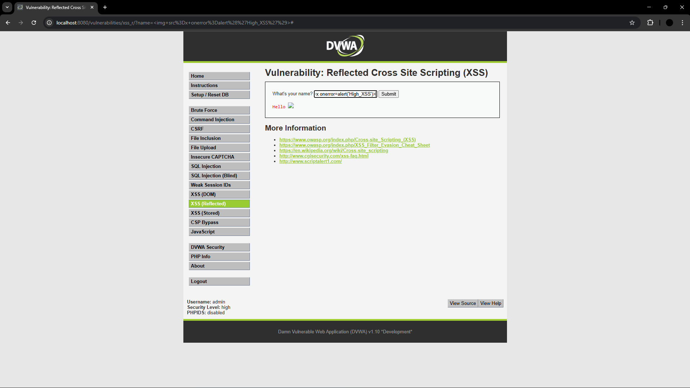  
**Why it failed / mitigation used:** The application uses a more robust regular expression `preg_replace()` that case-insensitively blocks any string following the pattern of a script tag.
**Why it still worked:** The focus of the protection is solely on the `<script>` tag. By using different HTML elements (like ``, `<body>`, or `<a>`) combined with JavaScript event handlers (like `onerror`, `onload`, or `onclick`), the blacklist is effectively bypassed.

---

## 12. XSS – Stored

### 🔴 Low Security
**Payload:**
```html
<script>alert('Stored XSS')</script>
```
**Result:**  
**Screenshot:** 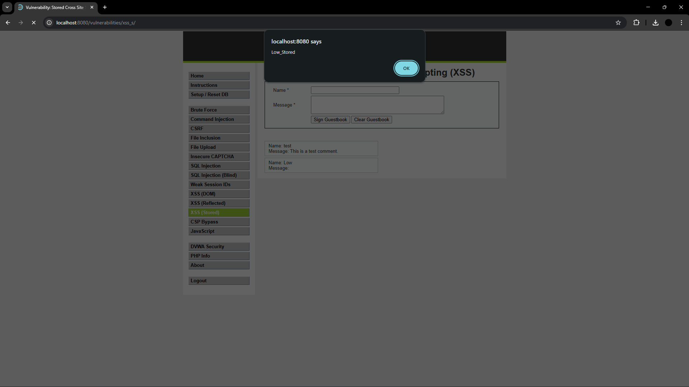  
**Why it worked:**  

---

### 🟡 Medium Security
**Payload:**  
**Result:**  
**Screenshot:**   
**Why it was harder:**  

---

### 🟢 High Security
**Payload:**  
**Result:**  
**Screenshot:** 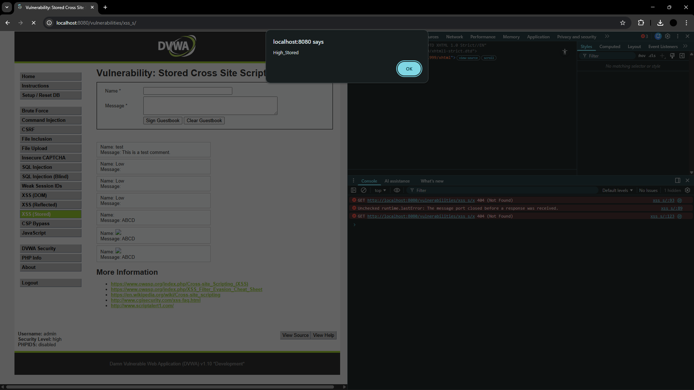  
**Why it failed / mitigation used:**  

---

## 13. JavaScript

### 🔴 Low Security
**Method:**  
**Result:**  
**Screenshot:**   
**Why it worked:**  

---

### 🟡 Medium Security
**Method:**  
**Result:**  
**Screenshot:**   
**Why it was harder:**  

---

### 🟢 High Security
**Method:**  
**Result:**  
**Screenshot:**   
**Why it failed / mitigation used:**  

---

## 14. CSP Bypass

### 🔴 Low Security
**Method:**  
**Result:**  
**Screenshot:**   
**Why it worked:**  

---

### 🟡 Medium Security
**Method:**  
**Result:**  
**Screenshot:** 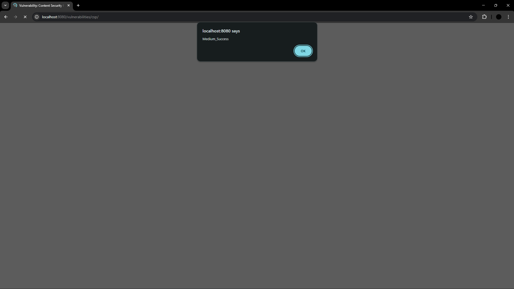  
**Why it was harder:**  

---

### 🟢 High Security
**Method:**  
**Result:**  
**Screenshot:** 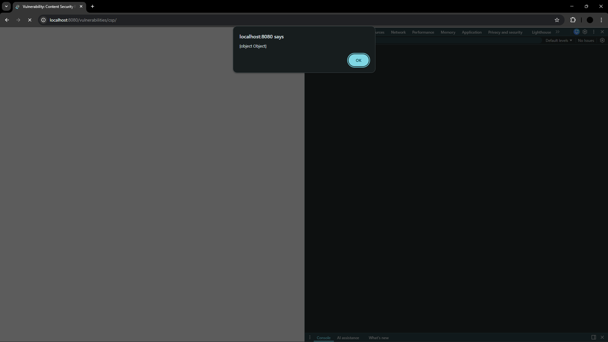  
**Why it failed / mitigation used:**  

---

## Docker Inspection

```bash
docker ps
```
**Output:**  

```bash
docker inspect dvwa
```
**Output (key fields):**  

```bash
docker logs dvwa
```
**Output:**  

```bash
docker exec -it dvwa /bin/bash
ls /var/www/html
```
**Output:**  

**Analysis:**
- **Application files location:**  
- **Backend technology:**  
- **How Docker isolates the environment:**  

---

## Security Analysis

**Q1. Why does SQL Injection succeed at Low security?**  

**Q2. What control prevents it at High?**  

**Q3. Does HTTPS prevent these attacks? Why or why not?**  

**Q4. What risks exist if this app is deployed publicly?**  

**Q5. OWASP Top 10 Mapping:**

| Vulnerability | OWASP Top 10 Category |
|---|---|
| Brute Force | A07:2021 – Identification & Auth Failures |
| Command Injection | A03:2021 – Injection |
| CSRF | A01:2021 – Broken Access Control |
| File Inclusion | A05:2021 – Security Misconfiguration |
| File Upload | A04:2021 – Insecure Design |
| Insecure CAPTCHA | A07:2021 – Identification & Auth Failures |
| SQL Injection | A03:2021 – Injection |
| SQL Injection (Blind) | A03:2021 – Injection |
| Weak Session IDs | A07:2021 – Identification & Auth Failures |
| XSS (DOM / Reflected / Stored) | A03:2021 – Injection |
| JavaScript | A05:2021 – Security Misconfiguration |
| CSP Bypass | A05:2021 – Security Misconfiguration |

---
